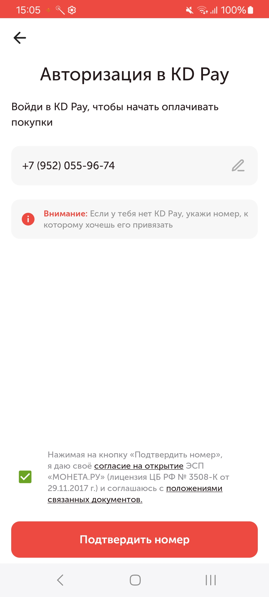
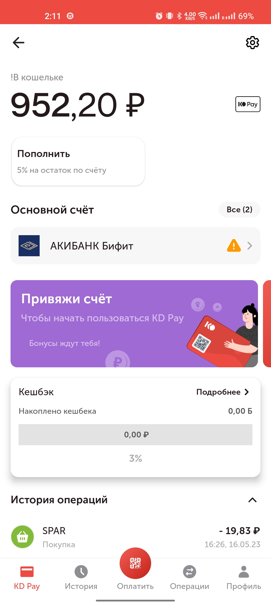
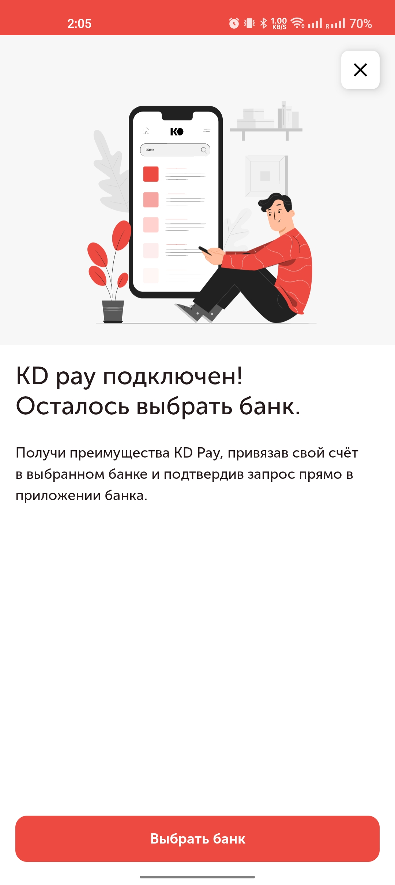
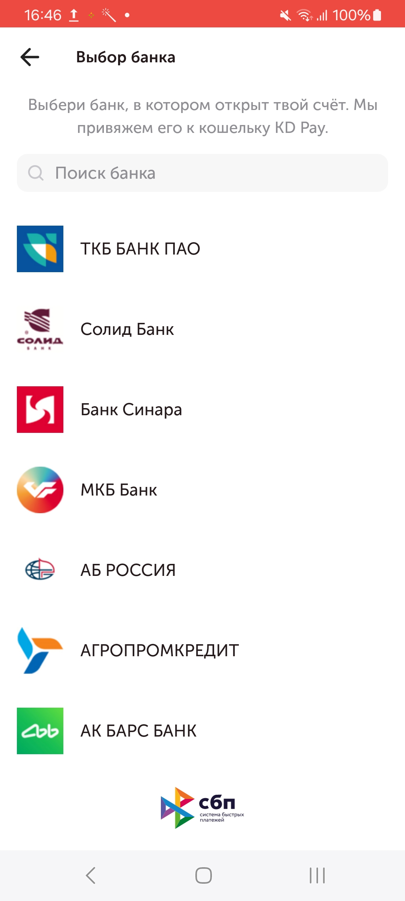
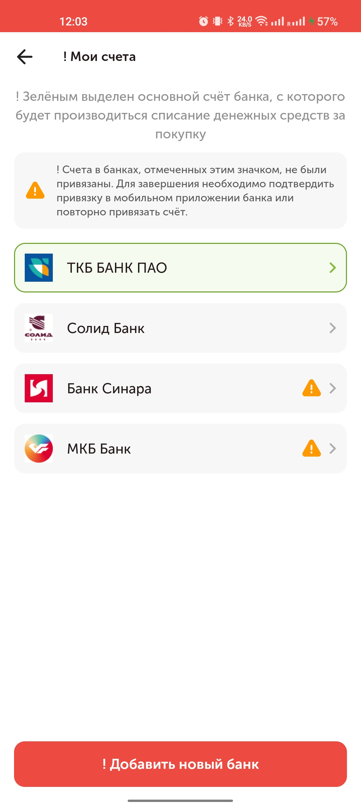
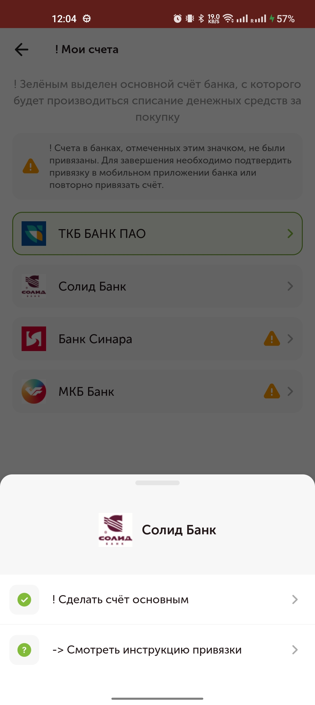
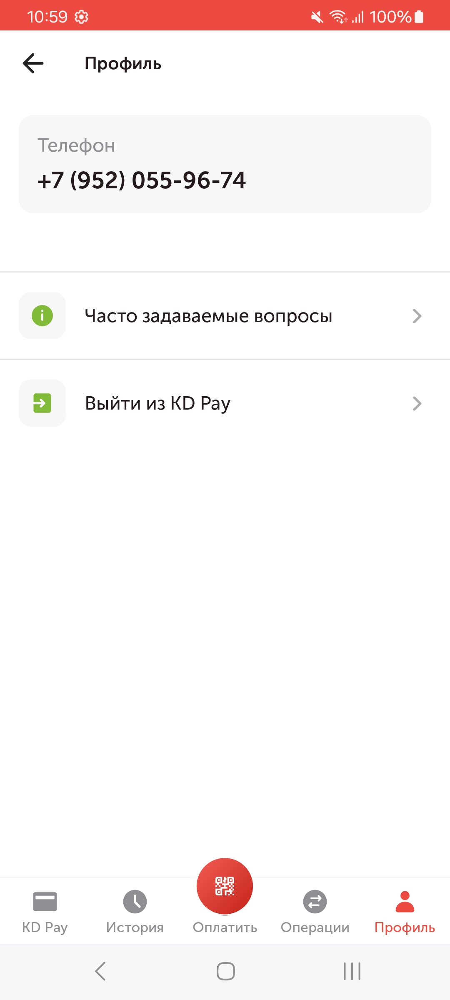
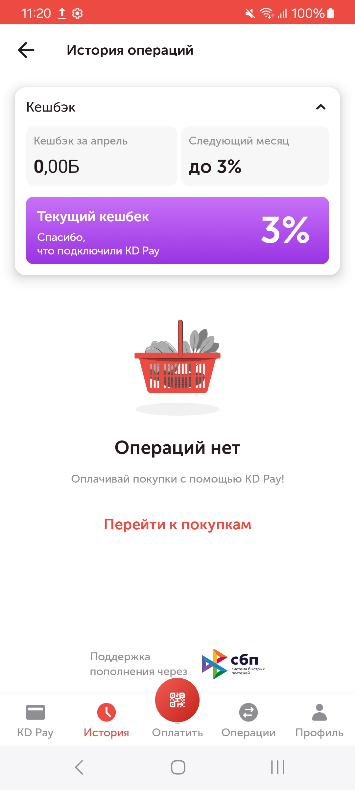

# KD Pay SDK (Android)

## Быстрый старт

1. Откройте Android Studio.
2. В диалоговом окне «File» → «New» выберите «Import Project».
3. В диалоговом окне выберите папку sdk-android.
4. Подождите, пока проект загрузится.
5. В «Build Variants» выберите «stage» или «release».

## Требования

```gradle
defaultConfig {
    minSdkVersion 24
}
```

## Интеграция через .aar модуль

- Для установки .aar модуля необходимо открыть настройки модуля `Open Module Settings`.
- В открывшемся окне следует выбрать вкладку `Modules` и нажать на кнопку `+`
- В открывшемся окне нужно указать опцию  `Import .JAR/.AAR Package` и нажать на кнопку `Next`
- На этом экране необходимо указать путь к файлу  `.aar ` и имя модуля, после чего нажать на кнопку  `Finish`

Далее в зависимостях модуля, либо в пакете app в build.gradle следует импортировать sdk.

 ```
 implementation project(':wallet-debug')
 ```

Так же для корректной работы SDK необходимо добавить следующие зависимости:

```
implementation "org.jetbrains.kotlin:kotlin-stdlib:$kotlin_version"
implementation 'org.jetbrains.kotlinx:kotlinx-coroutines-core:1.8.1'
implementation 'org.jetbrains.kotlinx:kotlinx-coroutines-android:1.8.1'

implementation 'com.squareup.retrofit2:retrofit:2.11.0'
implementation 'com.squareup.retrofit2:converter-gson:2.11.0'
implementation 'com.google.code.gson:gson:2.10.1'
implementation("com.squareup.okhttp3:logging-interceptor:4.12.0")

implementation("org.bouncycastle:bcprov-jdk18on:1.78.1")
implementation("org.bouncycastle:bcpkix-jdk18on:1.78.1")
```

Импортирование интерфейсного модуля Rx

```
implementation project(':wallet-debug-rx')
```

Зависимости

```
implementation group: 'io.reactivex.rxjava2', name: 'rxjava', version: '2.2.21'
implementation group: 'io.reactivex.rxjava2', name: 'rxandroid', version: '2.1.1'

implementation("com.squareup.okhttp3:okhttp:4.12.0")
api("com.squareup.okhttp3:logging-interceptor:4.12.0")

implementation("org.bouncycastle:bcprov-jdk18on:1.78.1")
implementation("org.bouncycastle:bcpkix-jdk18on:1.78.1")
```

# Сценарии использования SDK KD Pay

### Инициализация sdk

Для инициализации sdk необходимо создать экземпляр класса Wallet, либо WalletRx если используется технология RxJava.
В `Builder` необходимо передать context из Android SDK:

Далее перечисленны **обязательные** действия для инициализации SDK.
`setBuyerId(buyerId)` устанавливает идентификатор магазина.
`setAppVersion(appVersion)` устанавливает версию вашего приложения.
`setPlatform(platform)` передает платформу. Например, можно передать "android", "huawei", "app_gallery" и др.
Работа SDK без установки параметров выше невозможна. SDK выбросит исключение при инициализации, если какой-либо из
обязательных параметров не был задан.

Ниже перечислены необязательные параметры:
`setScreenSize(screenSize)` устанавливает размер, разрешение вашего экрана. Используется в запросах к беку. В
зависимости от него для некоторых устройств могут приходить иные картинки, тексты.

```
Wallet.Builder(context)
      .setBuyerId(buyerId)
      .setAppVersion(appVersion)
      .setPlatform(platform)
      .setScreenSize(screenSize)
      .build()
```

### Авторизация пользователя в системе KD Pay

Авторизация пользователя проходит в два этапа, для этого необходимо запросить у пользователя

- номер телефона (обязательное поле, на этот номер будет создан кошелёк),
- дополнительный номер телефона (необязательное),
- имя пользователя (необязательное),
- последний полученный идентификатор пользователя (необязательное),
- информацию об устройстве,
- идентификатор карты лояльности (необязательный).

После чего указанные данные передаются в
метод `login(userPhone, userBasePhone, userName, lastReceivedUserId,deviceInfo, loyaltyId)`.
Сервер в ответ на запрос посылает на номер пользователя шестизначный код, который вместе с `fcm` токеном
и `referrerId` (необязательный параметр) нужно передать в метод `confirmCode(code, fcmToken,referrerId)`. При успешном
ответе от сервера sdk сохраняет в кеше необходимые данные (публичный ключ сервера, идентификаторы сессии, информацию о
кошельке и пользователя). После чего пользователь считается авторизованным

```
fun login(userPhone: String, userBasePhone: String?, userName: String?, deviceInfo: DeviceInfo, loyaltyId: String?) {
    lifecycleScope.launch {
        try {
            wallet.login(userPhone, userBasePhone, userName, deviceInfo, loyaltyId)
        } catch (e: Exception) {
            Log.d(e)
        }
    }
}

fun confirm(code: String, fcmToken: String, referrerId: String?)) {
    lifecycleScope.launch {
        try {
            wallet.confirmCode(smsCode, fcmToken, referrerId)
        } catch (e: Exception) {
            Log.d(e)
        }
    }
}
```



### Ссылки на связанные документы:

Согласие на обработку персональных и биометрических данных и пользовательское соглашение -
https://storage.yandexcloud.net/slyanov-s3/gdpr_consent.html

Публичная оферта -
https://storage.yandexcloud.net/slyanov-s3/wallets_public_offer.html

### Публичный ключ для генерации QR-кода

SDK получает публичный ключ и сохраняет его в кеше после авторизации пользователя (метод `confirmCode`). Этот публичный
ключ хранится в кеше и считается валидным, пока в заголовке любого метода от сервера не
вернется `Need-Update-Server-key: true`, после чего SDK асинхронно дернет ручку обновления публичного ключа и при
успешном запросе значение в кеше будет заменено на новый публичный ключ. Это происходит незаметно для пользователя и
весь процесс инкапсулирован внутри SDK. Пользователь SDK извне никак не может повлиять на этот процесс.

### Получение аккаунта пользователя

Получение аккаунта осуществляется с помощью метода `getAccount`. Для успешного получения состояния кошелька пользователь
должен быть авторизован, должен подтвердить смс и сдк. Если клиент не авторизован в системе метод выбрасывает ошибку.

```
fun getAccount(cached: Boolean, referrerId: String?, variant: String?) {
    lifecycleScope.launch {
        try {
            wallet.getAccount(cached, referrerId, variant)
        } catch (e: Exception) {
            Log.d(e)
        }
    }
}
```   

В WalletAccountResult в поле bankLinkType приходит тип привязки банков : recurrent/me2me.



### Onboarding

В ответе WalletAccountResult приходит поле requiredScreens с массивом форм/экранов, которые можно показать перед
отображением кошелька, например "need_bank_link"



### Привязка банка к кошельку



Для того чтобы привязать к кошельку пользователя банк, необходимо получить список банков с помощью
метода `getBanks(bankLinkType: BankLinkType?)`.

```
fun getBanks(bankLinkType: BankLinkType?) {
    lifecycleScope.launch {
        try {
            wallet.getBanks(bankLinkType)
        } catch (e: Exception) {
            Log.d(e)
        }
    }
}
```  

**Возвращает**

| Тип          | Опциональный | Описание                                           |
|--------------|--------------|----------------------------------------------------|
| `List<Bank>` | Нет          | Список банков, которые можно привязать к кошельку. |

**Исключения**

| Тип                                   | Описание                                                                  |
|---------------------------------------|---------------------------------------------------------------------------|
| `ErrorMessage.Client.NotAuthorized()` | Сессия отсутствует или устарела                                           |
| `ErrorMessage.Client.Authorization()` | Отсутствует идентификатор пользователя в системе. Необходима авторизация. |
| `ErrorMessage.Client.NoAccount()`     | Нет аккаунта пользователя                                                 |

В ответе метода `getAccount` есть информация о типе платежного сервиса (bankLinkType): recurrent/me2me.
Нужно использовать это как параметр, чтобы получить список банков в зависимости от данного типа.

Для того чтобы использовать метод пользователь должен быть авторизован и у пользователя должен быть создан аккаунт. В
противном случае метод вызовет исключение.

Далее из списка полученных банков пользователь выбирает необходимый. После чего на сервер отправляется запрос
на привязку банка с помощью метода `addNewBank`.

```
fun addNewBank(bankId: Int, fundingSum: String?, bankLinkType: BankLinkType?) {
    lifecycleScope.launch {
        try {
            wallet.addNewBank(bankId, fundingSum, bankLinkType)
        } catch (e: Exception) {
            Log.d(e)
        }
    }
}
```   

Если сервер ответил успехом, то пользователю предлагается перейти в мобильное приложение банка и завершить процесс
привязки банка.

Возвращается BankAccountLinkageResult с id привязки банка, url с кастомной схемой выбранного
банка `bankID://sub.nspk.ru/...` и временем ожидания подписки expireTimeout.

Данную ссылку необходимо открыть в МП для перехода в мобильное приложение банка, если оно установлено на девайсе.

### Получение статуса банковской связи (результат привязки банка)

Для получения статуса банковской связи используется метод `getBankLinkageStatus(linkId: Int): BankLinkageResult`

**Параметры**

| Имя      | Тип | Опциональный | Описание      |
|----------|-----|--------------|---------------|
| `linkId` | Int | нет          | Идентификатор |

**Возвращает**

| Тип                 | Опциональный | Описание                                                |
|---------------------|--------------|---------------------------------------------------------|
| `BankLinkageResult` | Нет          | Статус привязки банка и id последующей onboarding story |

**Статусы привязки**

| Тип        | Описание                                    |
|------------|---------------------------------------------|
| `success`  | Банк привязан успешно                       |
| `pending`  | Ожидание привязки банка в приложении банка. |
| `canceled` | Привязка банка отменена                     |

### Получение привязанных банков

При возврате на главный экран кошелька и вызове метода `getAccount` в поле `banks` возвращаются банки,
которые успешно привязаны, либо находятся в процессе привязки.

Ориентируясь на список привязанных банков и `id` банка, который привязывается к аккаунту можно понять в каком статусе
находится привязка банка. Если банк присутствует в списке привязанных банков,
но поле `isLinked` у банка равно `false`- это значит что банк в процессе привязки к кошельку.
В случае если поле равно `true`, значит процесс привязки банка успешен. В случае если в списке банков нет искомого,
то это означает что произошла ошибка при привязке банка.



Если в методе `getAccount` возвращается bankLinkType - recurrent,
то список привязанных банков находится в массиве recurrentBanks, если me2me, то в account в поле banks

### Установить банк по умолчанию

После привязки банка он становится банком по умолчанию. Для того чтобы изменить банк по умолчанию, следует
воспользоваться методом `setDefaultBank`. Для того чтобы использовать метод пользователь должен быть авторизован и
у пользователя должен быть создан аккаунт, а так же привязан как минимум один банк.
Для начала следует получить данные аккаунта методом `getAccount`, предложить пользователю выбрать из списка
привязанных банков тот, который он хочет сделать основным.
Далее передать `id` этого банка и его тип в метод `setDefaultBank(bankId)`.
В результате чего в случае успеха метод вернет измененный и актуальный список привязанных банков.

`setDefaultBank(bankId: Int, bankLinkType: BankLinkType?): List<Bank>`

**Параметры**

| Имя          | Тип          | Опциональный | Описание                                                                     |
|--------------|--------------|--------------|------------------------------------------------------------------------------|
| bankId       | Int          | нет          | Идентификатор банка в системе KD Pay, выбранных из списка привязанных банков |
| bankLinkType | BankLinkType | да           | Тип банка (recurrent/me2me)                                                  |

**Возвращает**

| Тип        | Опциональный | Описание                                                     |
|------------|--------------|--------------------------------------------------------------|
| List<Bank> | Нет          | Список привязанных банков, с измененным банком по умолчанию. |

**Исключения**

| Тип                                 | Описание                                                                  |
|-------------------------------------|---------------------------------------------------------------------------|
| ErrorMessage.Client.NotAuthorized() | Сессия отсутствует или устарела                                           |
| ErrorMessage.Client.Authorization() | Отсутствует идентификатор пользователя в системе. Необходима авторизация. |



### Удаление привязанного банка (неактуально для рекуррентов)

Для удаления ранее привязанного банка используется метод

`deleteBank(bankId: Int)`

**Параметры**

| Имя    | Тип | Опциональный | Описание                                                                                                |
|--------|-----|--------------|---------------------------------------------------------------------------------------------------------|
| bankId | Int | нет          | Идентификатор банка в системе KD Pay, выбранных из списка банков получаемых с помощью метода getBanks() |

**Исключения**

| Тип                                 | Описание                                                                  |
|-------------------------------------|---------------------------------------------------------------------------|
| ErrorMessage.Client.NotAuthorized() | Сессия отсутствует или устарела                                           |
| ErrorMessage.Client.Authorization() | Отсутствует идентификатор пользователя в системе. Необходима авторизация. |
| ErrorMessage.Client.NoAccount()     | Нет аккаунта пользователя                                                 |

### Генерация QR кода

Для быстрого создания строки, кодируемой в qr-код, достаточно использовать метод `generateQrString(loyaltyId: String)`.
Метод не требует наличия интернета, если есть предзагруженные otp-коды.
(Otp-коды нужны также для генерации строки и SDK их самостоятельно (без действий на стороне МП) запрашивает на бэке "в
фоне", когда есть интернет).
Есть возможность "попросить" SDK в явном виде получить новую пачку otp-кодов для генерации QR-кода,
метод `requestOtpCode(amount)`. Для использования методов пользователь должен быть предварительно авторизован и иметь
аккаунт в системе.

**Параметры**

| Имя       | Тип    | Опциональный | Описание                                    |
|-----------|--------|--------------|---------------------------------------------|
| loyaltyId | String | нет          | Идентификатор лояльности во внешней системе |

**Возвращает**

| Тип    | Опциональный | Описание                        |
|--------|--------------|---------------------------------|
| String | Нет          | Строка для кодирования в Qr код |

**Исключения**

| Тип                                                | Описание                                                   |
|----------------------------------------------------|------------------------------------------------------------|
| ErrorMessage.Client.Serialization("No loyalty id") | loyaltyId пуст                                             |
| ErrorMessage.Client.NoOtpCode("No free OTP codes") | нет свободных otp кодов                                    |
| ErrorMessage.Client.Authorization                  | userId или публичный ключ сервера не существует в кеше SDK |

```
fun preloadOtp() {
    lifecycleScope.launch {
        try {
            if(!wallet.haveOtpCode()) wallet.requestOtpCode(OTP_CODE_AMOUT)
        } catch(e: Exception) {
            Log.d(e)
        }
    }
}

fun generateQrString(loyaltyId: String) {
    lifecycleScope.launch {
        val qrString = try {
            wallet.generateQrString(loyaltyId)
        } catch(e: Exception) {
            Log.d(e)
            null
        }

        qrString?.let { renderQrCode(it) }
    }
}
```

### Метод для проверки наличия сохраненных otp кодов в кеше sdk.

`haveOtpCode(): Boolean`

**Возвращает**

| Тип     | Опциональный | Описание                                                                            |
|---------|--------------|-------------------------------------------------------------------------------------|
| Boolean | Нет          | true - есть как минимум один сохраненный otp код. false - не сохраненных otp кодов. |

### Метод для получения одного свободного otp кода в кеше sdk. Код не помечается как использованный и будет выдан этим методом снова до использования

`getUnusedOtpCode(): String`

**Возвращает**

| Тип    | Опциональный | Описание                             |
|--------|--------------|--------------------------------------|
| String | Нет          | Возвращает один сохраненный otp код. |

**Исключения**

| Тип       | Описание                  |
|-----------|---------------------------|
| NoOtpCode | Если свободных кодов нет. |

### Метод для получения otp кодов с сервера с последующим сохранением в кеш sdk.

`requestOtpCodes(amount: Int)`
**Параметры**

| Имя    | Тип | Опциональный | Описание                                              |
|--------|-----|--------------|-------------------------------------------------------|
| amount | Int | нет          | Количество запрашиваемых otp кодов.  По умолчанию 10. |

**Исключения**

| Тип                                                                  | Описание                                                                  |
|----------------------------------------------------------------------|---------------------------------------------------------------------------|
| ErrorMessage.Client.NotAuthorized()                                  | Сессия отсутствует или устарела                                           |
| ErrorMessage.Client.Authorization()                                  | Отсутствует идентификатор пользователя в системе. Необходима авторизация. |
| ErrorMessage.Client.NoAccount()                                      | Нет аккаунта пользователя                                                 |
| ErrorMessage.Server.BadServerResponse("No code")                     | Ни один код не был получен от сервера.                                    |
| ErrorMessage.Server.BadServerResponse("No expiration time for code") | Нет срока окончания действия кода                                         |
| ErrorMessage.Client.NoBuyerId()                                      | Не установлен buyerId. Смотреть метод `configure(buyerId)`                |

### Метод для получения количества оставшихся otp кодов

`getRemainingOtpCodes(): Int`

**Возвращает**

| Тип | Опциональный | Описание                        |
|-----|--------------|---------------------------------|
| Int | Нет          | количество оставшихся otp кодов |

### Запрашивает указанное в параметре количество otp кодов, если их оставшееся количество валидных меньше 6

`requestOtpCodesIfRequired(amount: Int)`
**Параметры**

| Имя    | Тип | Опциональный | Описание                            |
|--------|-----|--------------|-------------------------------------|
| amount | Int | нет          | Количество запрашиваемых otp кодов. |

##### Запрашивает один свободный OTP код. Код не помечается как использованный и выдан этим методом снова до использования

`getOtpCode()`

**Исключения**

| Тип                             | Описание                                                                              |
|---------------------------------|---------------------------------------------------------------------------------------|
| ErrorMessage.Client.NoOtpCode() | свободных кодов нет. Перед запросом можно проверить на наличие вызвав `haveOtpCode()` |

### Получение данных профиля пользователя.

`fun getProfile(): Profile`

**Возвращает**

| Тип     | Опциональный | Описание                       |
|---------|--------------|--------------------------------|
| Profile | Нет          | Данные по профилю пользователя |



##### Получение данных профиля пользователя (детализация).

`fun getProfileDetails(): ProfileDetails`

**Возвращает**

| Тип            | Опциональный | Описание                                     |
|----------------|--------------|----------------------------------------------|
| ProfileDetails | Нет          | Данные по профилю пользователя (детализация) |

### Получение элементов для блока часто задаваемых вопросов.

`fun getFaq(cacheInterval: Long = 3600L, cacheUnit: TimeUnit = TimeUnit.SECONDS): List<FaqItem>`

**Параметры**

| Имя           | Тип      | Опциональный | Описание               |
|---------------|----------|--------------|------------------------|
| cacheInterval | Long     | нет          | интервал проверки кеша |
| cacheUnit     | TimeUnit | нет          | интервал проверки кеша |

**Возвращает**

| Тип           | Опциональный | Описание         |
|---------------|--------------|------------------|
| List<FaqItem> | нет          | Список элементов |

### Выход пользователя из KD pay.

Для выполнения выхода пользователя из системы KD pay необходимо использовать метод `logout()`, при этом выполняется
полная очистка кеша sdk. Удаляются идентификаторы сессии, пользователя, публичный ключ сервера, отп коды и номер
телефона пользователя. Параллельно на сервер отправляется запрос на сброс всех активных сессий.

### Получение информации о кешбэке и истории операций.



### Получение информации о кешбэке.

`fun getFaq(cacheInterval: Long = 3600L, cacheUnit: TimeUnit = TimeUnit.SECONDS): List<FaqItem>`
Для получения информации о кешбэке используем
метод `getCashbackInfo(prevMonth: Int, scenario: String, collapsed: Boolean, source: String): OperationElement`.
Имеет перегрузку метода с параметром ключ-значения для гибкой настройки параметров.

**Параметры**

| Имя       | Тип     | Опциональный | Описание                   |
|-----------|---------|--------------|----------------------------|
| prevMonth | Int     | нет          | период запроса данных      |
| scenario  | String  | нет          | место запроса данных       |
| collapsed | Boolean | нет          | скрытие виджетов в разделе |
| source    | String  | нет          | источник перехода          |

**Возвращает**

| Тип          | Опциональный | Описание             |
|--------------|--------------|----------------------|
| CashbackInfo | нет          | Информацию о кешбэке |

### Перегрузка метода информации о кешбэке

`getCashbackInfo(parameters: Map<String, String>): OperationElement`

**Параметры**

| Имя        | Тип                 | Опциональный | Описание                          |
|------------|---------------------|--------------|-----------------------------------|
| parameters | Map<String, String> | нет          | параметры в формате ключ-значение |

**Возвращает**

| Тип          | Опциональный | Описание             |
|--------------|--------------|----------------------|
| CashbackInfo | нет          | Информацию о кешбэке |

### Получение истории операции для пользователя

Получить историю операций для пользователя можно с помощью метода `getOperations`. В данный метод заложены параметры для
фильтрации операций. Бек вернет список операций, удовлетворяющих параметрам фильтрации.
Для первого запроса истории операции не нужно передавать курсор, в последующих запросах необходимо передавать курсор.
Бек вернет курсор в ответе на первый запрос, если пользователь имеет больше операций, чем бек может отдать за один
запрос.
Курсор (`cursor`) используется для пагинации операций.

```
fun getOperations(
    cursor: String? = null,
    type: OperationElement.OperationType? = null,
    partner: String? = null,
    datetimeStart: String? = null,
    datetimeFinish: String? = null,
    status: OperationElement.Status? = null
) {
    lifecycleScope.launch {
        try {
            wallet.getOperations(cursor, formId, type, partner, datetimeStart, datetimeFinish, status)
        } catch (e: Exception) {
            Log.d(e)
        }
    }
}
```

**Параметры**

| Имя            | Тип                            | Опциональный | Описание                               |
|----------------|--------------------------------|--------------|----------------------------------------|
| cursor         | String                         | да           | указатель на получение списка операций |
| type           | OperationElement.OperationType | да           | тип операции                           |
| partner        | String                         | да           | фильтр партнера                        |
| datetimeStart  | String                         | да           | дата начала фильтрации операции        |
| datetimeFinish | String                         | да           | дата конца фильтрации операции         |
| status         | OperationElement.Status        | да           | статус операции                        |

**Возвращает**

| Тип        | Опциональный | Описание                                          |
|------------|--------------|---------------------------------------------------|
| Operations | нет          | Список операций с предыдущим/следующим указателем |

### Получение конкретной операции для пользователя

Получить операцию для пользователя можно через метод `getOperation`. Важно, что id операции должен совпадать с типом
операции, иначе операция будет считаться на найденной.

```
fun getOperation(id: Int, type: OperationElement.OperationType) {
    lifecycleScope.launch {
        try {
            wallet.getOperation(id, type)
        } catch (e: Exception) {
            Log.d(e)
        }
    }
}
```

**Параметры**

| Имя  | Тип                            | Опциональный | Описание               |
|------|--------------------------------|--------------|------------------------|
| id   | String                         | нет          | идентификатор операции |
| type | OperationElement.OperationType | нет          | тип операции           |

**Возвращает**

| Тип              | Опциональный | Описание         |
|------------------|--------------|------------------|
| OperationElement | нет          | Элемент операции |

### Получение аккаунта пользователя

Получение аккаунта осуществляется с помощью метода `getAccount(cached: Boolean, referrerId: String?, variant: String?)`.
Для успешного получения состояния кошелька пользователь должен быть авторизован. Если клиент не авторизован в системе
метод выбрасывает исключение. При отсутствии аккаунта в ответе поле `walletAccountState` будет иметь значение `NONE`.

`getAccount(cached, referrerId, variant): WalletAccountResult`

**Параметры**

| Имя        | Тип     | Опциональный | Описание                                                                                                          |
|------------|---------|--------------|-------------------------------------------------------------------------------------------------------------------|
| cached     | Boolean | нет          | Флаг для определения откуда брать данные аккаунта. true - из кеша, false - из сервера с последующим кешированием. |
| referrerId | String  | да           | Идентификатор реферальной системы                                                                                 |
| variant    | String  | да           | Короткий вариант получения данных. Если указан `short`, то будут получены только основные данные по аккаунту.     |

**Возвращает**

| Тип                 | Опциональный | Описание                                                                  |
|---------------------|--------------|---------------------------------------------------------------------------|
| WalletAccountResult | Нет          | Ответ содержащий аккаунт пользователя в системе и текущий статус аккаунта |

**Исключения**
| Тип | Описание |
| ----------- | ----------- |
| ErrorMessage.Client.NotAuthorized("Not authorized") | Пользователь не авторизован в системе KD Pay. Либо устарела
сессия. |

```
fun getAccount() {
    lifecycleScope.launch {
        val result = try {
            wallet.getAccount(false)
        } catch (e: Exception) {
            if (e is ErrorMessage.Client.NotAuthorized) {
                processNotAuthorized()
            }
            Log.d(e)
            null
        }

        if (result?.walletAccountState == WalletAccountState.NONE) {
            processAccountNotExists()
        }

        if (result?.walletAccountState == WalletAccountState.READY) {
            processSucess(result)
        }
    }
}
```

### Получение формы

Для платежного сервиса в сценариях необходимы формы для получения информации о пользователе. Формы динамические, то есть
содержимое (состав полей) меняется в зависимости от контекста (сценария). Например, для привязывания счета необходимо
заполнить форму упрощенной идентификации.
Получение формы происходит через метод `getForm(type: String?, formId: Int?, version: Int?)`. Если запрос формы
произойдет без `formId`, то сервер пришлет чистую форму.
Если запрос происходит с `formId`, то SDK отправит 2 запроса на сервер:  `/form` и `/request`. Первый запрос получит
форму, второй получит статус валидации для полей. SDK соединит полученные результаты и вернет форму с провалидированными
полями.

*Примечание: количество полей и их состав сервер может поменять на своей стороне, форма является динамической.*

```
fun getForm(type: String?, formId: Int?, version: Int?) {
    lifecycleScope.launch {
        try {
            wallet.getForm(type: String?, formId: Int?, version: Int?)
        } catch (e: Exception) {
            Log.d(e)
        }
    }
}
```

### Валидация полей формы

Для валидации полей используется
метод `sendFormDraft(type: String, formId: Int?, version: Int?, draftFields: Map<Int, String>)`. Первый запрос на
валидацию всегда будет происходить без `formId` и `version`. Актуальные значения `formId` и `version` вернутся при
первой и последующей валидации. Валидировать необходимо все заполненные поля.

*Примечание: сервер сохраняет в следующем драфте поля "вместо" предыдущих. То есть если в первой версии драфта МП
отправило заполненное поле 1, а потом не прислало это поле или прислало пустое, то в этой версии драфта поле не будет
сохранено на сервере.*

При `sendFormDraft(type: String, formId: Int?, version: Int?, draftFields: Map<Int, String>)` SDK уберет пустые поля из
запроса, чтобы не заваливать пользователя ошибками на пустых полях.

```
fun sendFormDraft(type: String, formId: Int?, version: Int?, draftFields: Map<Int, String>) {
    lifecycleScope.launch {
        try {
            wallet.sendFormDraft(type, formId, version, draftFields)
        } catch (e: Exception) {
            Log.d(e)
        }
    }
}
```

### Отправка формы на проверку

Для валидации полей используется
метод `sendFormCommit(type: String, formId: Int?, version: Int?, draftFields: Map<Int, String>)`. Первый запрос
на `commit` может происходить без `formId` и `version`. Актуальные значения `formId` и `version` вернутся при первом и
последующем `commit`. Отправлять необходимо все поля.

При `sendFormCommit(type: String, formId: Int?, version: Int?, draftFields: Map<Int, String>)` сервер отправит **все**
поля, даже пустые, чтобы уведомить пользователя о незаполненных полях.

```
fun sendFormDraft(type: String, formId: Int?, version: Int?, draftFields: Map<Int, String>) {
    lifecycleScope.launch {
        try {
            wallet.sendFormDraft(type, formId, version, draftFields)
        } catch (e: Exception) {
            Log.d(e)
        }
    }
}
```

## Дополнительные методы для взаимодействия с сервисом KD pay

#### Метод для проверки состояния сервиса.

`ping()`

#### Метод возвращает идентификатор пользователя, если имеется.

`getUserId(): Int`

**Возвращает**

| Тип      | Опциональный | Описание                                           |
|----------|--------------|----------------------------------------------------|
| UserInfo | Нет          | Возвращает userId пользователя, если такой имеется |

#### Проверка истек ли срок действия ключа.

`fun isKeyExpired(): Boolean`

**Возвращает**

| Тип     | Опциональный | Описание                                  |
|---------|--------------|-------------------------------------------|
| Boolean | Нет          | true - ключ истек , false - ключ не истек |

##### Обновить клиентские ключи и отправить публичный ключ на сервер.

`fun updateClientPublicKey(deviceId: String)`

**Параметры**

| Имя      | Тип    | Опциональный | Описание                                                                                                                                                                                                               |
|----------|--------|--------------|------------------------------------------------------------------------------------------------------------------------------------------------------------------------------------------------------------------------|
| deviceId | String | да           | Идентификатор пользователя в системе.  Если не указан используется 64-битное число (выраженное в виде шестнадцатеричной строки), уникальное для каждой комбинации ключа подписи приложения, пользователя и устройства. |

##### Callback на необходимость обновления токена пользователя.

`needUpdateUserDevice: StateFlow<Boolean>`

##### Callback на необходимость обновления клиентских ключей

`needUpdateClientPublicKey: StateFlow<Boolean>`

##### Обновить токен пользователя на сервере.

`fun updateUserDevice(deviceId: String, fcmToken: String)`

**Параметры**

| Имя      | Тип    | Опциональный | Описание                                                                                                                                                                                                               |
|----------|--------|--------------|------------------------------------------------------------------------------------------------------------------------------------------------------------------------------------------------------------------------|
| deviceId | String | да           | Идентификатор пользователя в системе.  Если не указан используется 64-битное число (выраженное в виде шестнадцатеричной строки), уникальное для каждой комбинации ключа подписи приложения, пользователя и устройства. |
| fcmToken | String | нет          | Токен Firebase Messaging Service [подробнее](https://firebase.google.com/docs/cloud-messaging/android/client).                                                                                                         |

##### Проверка доступа к кошелькам. Имеет кеширование. Возвращает результат предыдущего запроса, параллельно выполняя новый запрос. Если интервал не задан, кеш считается валидным 1 час.

`getUserExperiment(phone: String, applicationVersion: String, deviceId: String?, loyaltyId: String, cacheInterval: Long): List<String>`

**Параметры**

| Имя                | Тип    | Опциональный | Описание                                                                                                                                                                                                               |
|--------------------|--------|--------------|------------------------------------------------------------------------------------------------------------------------------------------------------------------------------------------------------------------------|
| phone              | String | нет          | Телефон указанный пользователем                                                                                                                                                                                        |
| applicationVersion | String | нет          | Версия приложения                                                                                                                                                                                                      |
| deviceId           | String | да           | Идентификатор пользователя в системе.  Если не указан используется 64-битное число (выраженное в виде шестнадцатеричной строки), уникальное для каждой комбинации ключа подписи приложения, пользователя и устройства. |
| loyaltyId          | String | нет          | номер карты лояльности                                                                                                                                                                                                 |
| cacheInterval      | Long   | да           | Интервал проверки кэша в секундах. Если не выставлен интервал, то кеш на 1 час.                                                                                                                                        |

**Возвращает**

| Тип          | Опциональный | Описание                                             |
|--------------|--------------|------------------------------------------------------|
| List<String> | Нет          | Вернет список экспериментов для данного пользователя |

##### Проверяет авторизован ли пользователь в системе по таким признакам как наличие в кеше идентификатора сессии и пользователя. А так же наличию публичного ключа сервера.

`isAuthorized(): Boolean`

**Возвращает**

| Тип     | Опциональный | Описание                                                                                                                                    |
|---------|--------------|---------------------------------------------------------------------------------------------------------------------------------------------|
| Boolean | Нет          | true - пользователь авторизован, false - не авторизован (Нет идентификатора сессии, пользователя, либо публичного ключа сервера в кеше SDK) |

##### Получение состояние аккаунта в системе KD Pay.

`getUserPreview(cached: Boolean = false, manzanaUserId: String?, loyaltyId: String?, source: String?): WalletAccountResult`

**Параметры**

| Имя           | Тип     | Опциональный | Описание                                                                                                          |
|---------------|---------|--------------|-------------------------------------------------------------------------------------------------------------------|
| cached        | Boolean | нет          | Флаг для определения откуда брать данные аккаунта. true - из кеша, false - из сервера с последующим кешированием. |
| manzanaUserId | String  | да           | Идентификатор пользователя                                                                                        |
| loyaltyId     | String  | нет          | номер карты лояльности                                                                                            |
| source        | String  | нет          | источник перехода                                                                                                 |

**Возвращает**

| Тип                 | Опциональный | Описание                                                                  |
|---------------------|--------------|---------------------------------------------------------------------------|
| WalletAccountResult | Нет          | Ответ содержащий аккаунт пользователя в системе и текущий статус аккаунта |

**Исключения**

| Тип                                                 | Описание                                                            |
|-----------------------------------------------------|---------------------------------------------------------------------|
| ErrorMessage.Client.NotAuthorized("Not authorized") | Пользователь не авторизован в системе KD Pay. Либо устарела сессия. |

##### Получение информации фондирования.

`getFundingInfo(cacheInterval: Long, cacheUnit: TimeUnit): FundingInfo

**Параметры**

| Имя           | Тип      | Опциональный | Описание                                                                               |
|---------------|----------|--------------|----------------------------------------------------------------------------------------|
| cacheInterval | Long     | да           | Интервал проверки кэша в секундах. Если не выставлен интервал, то кеш не используется. |
| cacheUnit     | TimeUnit | нет          | интервал проверки кеша                                                                 |

**Возвращает**

| Тип        | Опциональный | Описание                                           |
|------------|--------------|----------------------------------------------------|
| List<Bank> | Нет          | Список банков, которые можно привязать к кошельку. |

**Исключения**

| Тип                                 | Описание                                                                  |
|-------------------------------------|---------------------------------------------------------------------------|
| ErrorMessage.Client.NotAuthorized() | Сессия отсутствует или устарела                                           |
| ErrorMessage.Client.Authorization() | Отсутствует идентификатор пользователя в системе. Необходима авторизация. |
| ErrorMessage.Client.NoAccount()     | Нет аккаунта пользователя                                                 |

##### Метод получения формы упрощенной идентификации

`getForm(type: String?, formId: Int?, version: Int?): Form`

**Параметры**

| Имя     | Тип    | Опциональный | Описание                                            |
|---------|--------|--------------|-----------------------------------------------------|
| type    | String | да           | Тип формы, которая задает определенный набор полей. |
| formId  | Int    | да           | Идентификатор последнего актуального заполнения.    |
| version | Int    | да           | Версия последнего актуального заполнения            |

**Возвращает**

| Тип  | Опциональный | Описание                                        |
|------|--------------|-------------------------------------------------|
| Form | Нет          | Форма для упрощенной идентификации пользователя |

**Исключения**

| Тип                                 | Описание                                                                  |
|-------------------------------------|---------------------------------------------------------------------------|
| ErrorMessage.Client.NotAuthorized() | Сессия отсутствует или устарела                                           |
| ErrorMessage.Client.Authorization() | Отсутствует идентификатор пользователя в системе. Необходима авторизация. |

##### Метод для отправки черновика формы

`sendFormDraft(type: String, formId: Int?, version: Int?, draftFields: Map<Int, String>): FormDraft`

**Параметры**

| Имя         | Тип              | Опциональный | Описание                                            |
|-------------|------------------|--------------|-----------------------------------------------------|
| type        | String           | нет          | Тип формы, которая задает определенный набор полей. |
| formId      | Int              | да           | Идентификатор последнего актуального заполнения.    |
| version     | Int              | да           | Версия последнего актуального заполнения.           |
| draftFields | Map<Int, String> | нет          | Идентификатор валидируемого поля и его значение.    |

**Возвращает**

| Тип       | Опциональный | Описание                                              |
|-----------|--------------|-------------------------------------------------------|
| FormDraft | Нет          | Актуальная информация формы и список невалидных полей |

**Исключения**

| Тип                                 | Описание                                                                  |
|-------------------------------------|---------------------------------------------------------------------------|
| ErrorMessage.Client.NotAuthorized() | Сессия отсутствует или устарела                                           |
| ErrorMessage.Client.Authorization() | Отсутствует идентификатор пользователя в системе. Необходима авторизация. |
| ErrorMessage.Client.NoAccount()     | Нет аккаунта пользователя                                                 |

##### Метод для получения формы поддержки

`getUserSupportForm(clientId: Int): Form`

**Параметры**

| Имя      | Тип | Опциональный | Описание               |
|----------|-----|--------------|------------------------|
| clientId | Int | да           | Идентификатор клиента. |

**Возвращает**

| Тип  | Опциональный | Описание                                        |
|------|--------------|-------------------------------------------------|
| Form | Нет          | Форма для упрощенной идентификации пользователя |

**Исключения**

| Тип                                 | Описание                                                                  |
|-------------------------------------|---------------------------------------------------------------------------|
| ErrorMessage.Client.NotAuthorized() | Сессия отсутствует или устарела                                           |
| ErrorMessage.Client.Authorization() | Отсутствует идентификатор пользователя в системе. Необходима авторизация. |
| ErrorMessage.Client.NoAccount()     | Нет аккаунта пользователя                                                 |

##### Метод для подсказки для полей формы

`getFormSuggestions(fieldId: Int, value: String): Map<Int, String>`

**Параметры**

| Имя     | Тип    | Опциональный | Описание            |
|---------|--------|--------------|---------------------|
| fieldId | Int    | да           | Идентификатор поля. |
| value   | String | да           | Значение поля.      |

**Возвращает**

| Тип              | Опциональный | Описание                          |
|------------------|--------------|-----------------------------------|
| Map<Int, String> | Нет          | Подсказки в формате ключ-значение |

##### Метод для коммита формы

`sendFormCommit(type: String, formId: Int?, version: Int?, draftFields: Map<Int, String>): FormDraft`

**Параметры**

| Имя         | Тип              | Опциональный | Описание                                            |
|-------------|------------------|--------------|-----------------------------------------------------|
| type        | String           | нет          | Тип формы, которая задает определенный набор полей. |
| formId      | Int              | да           | Идентификатор последнего актуального заполнения.    |
| version     | Int              | да           | Версия последнего актуального заполнения.           |
| draftFields | Map<Int, String> | нет          | Идентификатор валидируемого поля и его значение.    |

**Возвращает**

| Тип       | Опциональный | Описание                                              |
|-----------|--------------|-------------------------------------------------------|
| FormDraft | Нет          | Актуальная информация формы и список невалидных полей |

**Исключения**

| Тип                                 | Описание                                                                  |
|-------------------------------------|---------------------------------------------------------------------------|
| ErrorMessage.Client.NotAuthorized() | Сессия отсутствует или устарела                                           |
| ErrorMessage.Client.Authorization() | Отсутствует идентификатор пользователя в системе. Необходима авторизация. |
| ErrorMessage.Client.NoAccount()     | Нет аккаунта пользователя                                                 |

##### Метод проверки версии библиотеки. Имеет кеширование. Возвращает результат предыдущего запроса, параллельно выполняя новый запрос.

`checkLibraryVersion(cacheInterval: Long = 0L): VersionResult`

**Параметры**

| Имя           | Тип  | Опциональный | Описание                                                                               |
|---------------|------|--------------|----------------------------------------------------------------------------------------|
| cacheInterval | Long | да           | Интервал проверки кэша в секундах. Если не выставлен интервал, то кеш не используется. |

**Возвращает**

| Тип           | Опциональный | Описание                                                                         |
|---------------|--------------|----------------------------------------------------------------------------------|
| VersionResult | нет          | Возвращает результат проверки. При любой ошибке возвращает VersionResult.UNKNOWN |

#### Уведомляет сервер о показанных оповещениях пользователю. Возвращает список id оповещений с актуальным статусом

`notifySnacksShown(shownSnacks: Map<Int, Long>): List<SnacksShownStatus>`

**Параметры**

| Имя         | Тип            | Опциональный | Описание                              |
|-------------|----------------|--------------|---------------------------------------|
| shownSnacks | Map<Int, Long> | нет          | id и timestamp показанного оповещения |

**Возвращает**

| Тип               | Опциональный | Описание                                   |
|-------------------|--------------|--------------------------------------------|
| SnacksShownStatus | нет          | Список id оповещений с актуальным статусом |

### Получение информации об автопополнении.

`getAutoReplenishmentInfo(): AutoReplenishmentInfo`

**Возвращает**

| Тип                   | Опциональный | Описание                    |
|-----------------------|--------------|-----------------------------|
| AutoReplenishmentInfo | нет          | Информации о автопополнении |

#### Включить/выключить автопополнение

`fun toggleAutoReplenishment(isActive: Boolean, bankId: Int, sumValue: String?,sumCurrency: String?,)`

**Параметры**

| Имя         | Тип     | Опциональный | Описание                             |
|-------------|---------|--------------|--------------------------------------|
| isActive    | Boolean | нет          | вкл или выкл                         |
| bankId      | Int     | нет          | уникальный идентификатор банка       |
| sumValue    | String  | нет          | минимальная сумма для автопополнения |
| sumCurrency | String  | нет          | валюта суммы для автопополнения      |

### Операция пополнения счёта KD Pay

`fun replenishment(bankId: Int, sumValue: String, sumCurrency: String): ReplenishmentStatus`

**Параметры**

| Имя         | Тип    | Опциональный | Описание                             |
|-------------|--------|--------------|--------------------------------------|
| bankId      | Int    | нет          | уникальный идентификатор банка       |
| sumValue    | String | нет          | минимальная сумма для автопополнения |
| sumCurrency | String | нет          | валюта суммы для автопополнения      |

**Возвращает**

| Тип                 | Опциональный | Описание          |
|---------------------|--------------|-------------------|
| ReplenishmentStatus | нет          | Статус пополнения |

### Получения статуса пополнения счёта KD Pay

`fun getReplenishmentStatus() : ReplenishmentStatus`

**Возвращает**

| Тип                 | Опциональный | Описание          |
|---------------------|--------------|-------------------|
| ReplenishmentStatus | нет          | Статус пополнения |

# Структуры данных

#### `BankLinkageResult`

| Имя          | Описание                         |
|--------------|----------------------------------|
| status       | статус связи (BankLinkageStatus) |
| finalStoryId | идентификатор                    |

#### `BankLinkageStatus` enum

| Имя      | Описание       |
|----------|----------------|
| SUCCESS  | Успех связи    |
| PENDING  | Ожидание связи |
| CANCELED | Отмена связи   |

#### `ReplenishmentStatus` enum

| Имя        | Описание                      |
|------------|-------------------------------|
| UNKNOWN    | Статус пополнения не известен |
| IN_PROCESS | В процессе пополнения         |
| SUCCESS    | Успех пополнения              |
| CREATED    | Создан для  пополнения        |
| CANCELED   | Отменена пополнения           |
| ERROR      | Ошибка пополнения             |

#### `WalletAccountResult`

| Имя свойства       | Тип                | Опциональный | Описание                                  |
|--------------------|--------------------|--------------|-------------------------------------------|
| walletAccountState | WalletAccountState | нет          | Описывает состояние аккаунта              |
| walletAccount      | WalletAccount      | да           | Модель данных кошелька                    |
| banners            | BannerAccount      | да           | Список баннеров                           |
| messages           | MessagesAccount    | да           | Информационное сообщение о работе сервера |
| snacks             | Snacks             | да           | Список снекбаров                          |

#### `WalletAccountState` enum

| Имя     | Описание                            |
|---------|-------------------------------------|
| NONE    | Нет аккаунта пользователя           |
| PENDING | Аккаунта в процессе создания        |
| READY   | Аккаунт существует и готов к работе |
| BANNED  | Аккаунт забанен                     |

#### `WalletAccount`

| Имя свойства | Тип                 | Опциональный                 | Описание                                 |
|--------------|---------------------|------------------------------|------------------------------------------|
| id           | Int                 | нет                          | Идентификатор аккаунта                   |
| balance      | BigDecimal          | нет ( 0 по умолчанию)        | Баланс пользователя                      |
| currency     | String              | нет                          | Строковый код валюты                     |
| status       | WalletStatus        | нет (Undefined по умолчанию) | Состояние кошелька                       |
| banks        | List<Bank>          | нет                          | 	Список привязанных к кошельку банков    |
| forms        | List<FormsResponse> | да                           | Список форм для упрощенной идентификации |

#### `WalletStatus ` enum

| Имя       | Описание                         |
|-----------|----------------------------------|
| Undefined | Неизвестное состояние кошелька   |
| Active    | Кошелек активен и готов к работе |
| Blocked   | Кошелек заблокирован             |
| Closed    | Кошелек закрыт                   |

#### `BannerAccount`

| Имя свойства | Тип               | Опциональный | Описание                                                         |
|--------------|-------------------|--------------|------------------------------------------------------------------|
| positionType | String            | нет          | Вариант отображения баннеров, например списком, каруселью и т.п. |
| items        | List<BannerItems> | да           | Список баннеров                                                  |

#### `BannerItems`

| Имя свойства | Тип                | Опциональный | Описание                  |
|--------------|--------------------|--------------|---------------------------|
| id           | Int                | нет          | Идентификатор баннера     |
| type         | String             | нет          | Тип баннера               |
| params       | List<BannerParams> | нет          | Список параметров баннера |

#### `BannerParams`

| Имя свойства    | Тип    | Опциональный | Описание                         |
|-----------------|--------|--------------|----------------------------------|
| name            | String | да           | Имя параметра                    |
| value           | String | да           | Значение параметра               |
| textColor       | String | да           | Цвет значения (текста) параметра |
| type            | String | да           | Тип параметра                    |
| backgroundColor | String | да           | Цвет фона параметра              |

#### `MessagesAccount`

| Имя свойства    | Тип             | Опциональный | Описание                                |
|-----------------|-----------------|--------------|-----------------------------------------|
| badStatusServer | BadStatusServer | да           | Сообщение о некорректной работе сервера |

#### `BadStatusServer`

| Имя свойства | Тип    | Опциональный | Описание            |
|--------------|--------|--------------|---------------------|
| title        | String | нет          | Заголовок сообщения |
| description  | String | нет          | Описание сообщения  |

#### `Snacks`

| Имя свойства | Тип         | Опциональный | Описание            |
|--------------|-------------|--------------|---------------------|
| type         | String      | нет          | Вариант отображения |
| items        | List<Snack> | нет          | Список снеков       |

#### `Snack`

| Имя свойства | Тип                 | Опциональный | Описание            |
|--------------|---------------------|--------------|---------------------|
| id           | Int                 | нет          | Идентификатор снэка |
| type         | Type                | нет          | Тип снэка           |
| params       | Map<String, String> | нет          | Параметры снэка     |

#### `Type` enum

| Имя      | Описание                 |
|----------|--------------------------|
| BankLink | Снек привязки банка      |
| Sui      | Снек УПРИДа              |
| Referral | Снек реферальной системы |
| Unknown  | Неизвестный тип снэка    |

#### `Bank`

| Имя свойства    | Тип     | Опциональный             | Описание                                                                                                                               |
|-----------------|---------|--------------------------|----------------------------------------------------------------------------------------------------------------------------------------|
| id              | Int     | нет                      | Идентификатор банка в системе                                                                                                          |
| name            | String  | нет                      | Имя банка в системе                                                                                                                    |
| imageLink       | String  | да                       | Ссылка на логотип банка                                                                                                                |
| isLinked        | Boolean | нет (false по умолчанию) | Состояние привязки банка. Если банк присутствует в списке, но его статус isLinked == false, это означает что банк в процессе привязки. |
| isDefault       | Boolean | нет (false по умолчанию) | Банк выбран основным. С счета этого банка будут сниматься средства при платежах кошельком.                                             |
| isRetryPossible | Boolean | нет (false по умолчанию) | Возможность отправить запрос на привязку заново.                                                                                       |
| instructionUrl  | String  | да                       | Ссылка на инструкцию по привязке                                                                                                       |

#### `MessagesAccount`

| Имя свойства | Тип             | Опциональный | Описание                                                           |
|--------------|-----------------|--------------|--------------------------------------------------------------------|
| badStatus    | BadStatusServer | да           | Сообщение о нестабильности сервера                                 |
| badTime      | BadTime         | да           | Сообщение о некорректных настройках даты, времени и часового пояса |

#### `BadStatusServer`

| Имя свойства | Тип               | Опциональный | Описание            |
|--------------|-------------------|--------------|---------------------|
| title        | String            | нет          | Заголовок сообщения |
| description  | BadStatusResponse | нет          | Описание сообщения  |

#### `BadTime`

| Имя свойства | Тип    | Опциональный | Описание            |
|--------------|--------|--------------|---------------------|
| title        | String | да           | Заголовок сообщения |
| text         | String | нет          | Описание сообщения  |
| button       | String | нет          | Текст для кнопки    |

#### `FormAccount`

| Имя свойства | Тип        | Опциональный | Описание                                                                                                  |
|--------------|------------|--------------|-----------------------------------------------------------------------------------------------------------|
| type         | String     | нет          | Тип формы, задает конкретный набор полей                                                                  |
| status       | FormStatus | да           | Статус формы последнего актуального заполнения. Пустое поле или нет поля – пользователь не заполнял форму |
| formId       | Int        | да           | Идентификатор формы последнего актуального заполнения                                                     |
| isRequired   | Boolean    | нет          | Необходимо ли пользователю заполнить/дозаполнить форму                                                    |
| description  | String     | нет          | Текст, который можно показать пользователю                                                                |
| version      | Int        | да           | Версия формы последнего актуального заполнения                                                            |

#### `FormStatus` enum

| Имя        | Значение   | Описание                                 |
|------------|------------|------------------------------------------|
| Draft      | draft      | Форма заполнялась, но не была отправлена |
| Commit     | commit     | Форма была отправлена, но не запушена    |
| Processing | processing | Форма в процессе обработки               |
| Invalid    | invalid    | Форма заполнена неверно                  |
| Success    | success    | Форма успешно заполнена                  |
| NotExists  | not_exists | Форма отсутствует                        |
| Unknown    | unknown    | Форма неизвестна                         |

#### `Form`

| Имя свойства     | Тип                   | Опциональный | Описание                                                                         |
|------------------|-----------------------|--------------|----------------------------------------------------------------------------------|
| id               | Int                   | да           | Идентификатор формы. Может его не быть, если форму пользователь получает впервые |
| version          | FormStatus            | нет          | Статус формы последнего актуального заполнения.                                  |
| pageCount        | Int                   | нет          | Количество страниц                                                               |
| title            | String                | да           | Заголовок формы                                                                  |
| pages            | Map<Int, FormPage>    | нет          | Словарь страниц сформированный по `FormPage.id` идентификаторам                  |
| visibilityChecks | List<VisibilityCheck> | нет          | Список проверки видимости                                                        |

#### `FormPage`

| Имя свойства     | Тип                 | Опциональный | Описание                                       |
|------------------|---------------------|--------------|------------------------------------------------|
| id               | Int                 | нет          | Идентификатор страницы                         |
| number           | Int                 | нет          | Номер страницы                                 |
| name             | String              | да           | 	Имя страницы                                  |
| description      | String              | да           | Описание страницы                              |
| groups           | Map<Int, FormGroup> | нет          | Словарь групп сформированный по `FormGroup.id` |
| submitButtonText | String              | да           | Текст на кнопке отправки страницы формы        |

#### `VisibilityCheck`

| Имя свойства     | Тип                      | Опциональный | Описание                                                                                             |
|------------------|--------------------------|--------------|------------------------------------------------------------------------------------------------------|
| dependantFieldId | Int                      | нет          | Идентификатор зависимого поля                                                                        |
| parentFieldId    | Int                      | нет          | Идентификатор родительского поля. У группы зависимых элементов родительский идентификатор совпадает. |
| operation        | VisibilityCheckOperation | да           | Операция проверки видимости                                                                          |
| value            | String                   | да           | Значение проверки видимости                                                                          |

#### `VisibilityCheckOperation ` enum

| Имя     | Описание                                                                      |
|---------|-------------------------------------------------------------------------------|
| Equals  | Проверка на равенство. `check = { FormField, String-> field.value == value }` |
| Unknown | Всегда возвращает true. `check = { _, _ -> true } `                           |

#### `FormGroup`

| Имя свойства | Тип                 | Опциональный | Описание                                       |
|--------------|---------------------|--------------|------------------------------------------------|
| id           | Int                 | нет          | Идентификатор группы                           |
| number       | Int                 | нет          | Номер группы                                   |
| pageId       | Int                 | нет          | Идентификатор страницы                         |
| name         | String              | да           | Имя группы                                     |
| description  | String              | да           | Описание группы                                |
| fields       | Map<Int, FormField> | нет          | Словарь полей сформированный по `FormField.id` |

#### sealed `FormField`

| Имя свойства     | Тип              | Опциональный | Описание                                             |
|------------------|------------------|--------------|------------------------------------------------------|
| id               | Int              | нет          | Идентификатор поля                                   |
| groupId          | Int              | да           | Идентификатор группы                                 |
| isRequired       | Boolean          | нет          | Требуется ли для заполнения По умолчанию всегда true |
| isVisible        | Boolean          | нет          | Видимость поля По умолчанию всегда  true             |
| value            | String           | да           | Значение поля                                        |
| initialValue     | String           | да           | Изначальное значение поля                            |
| validationResult | ValidationResult | да           | Результат валидации поля                             |

#### `RadioGroup` : FormField

| Имя свойства | Тип                   | Опциональный | Описание                                                   |
|--------------|-----------------------|--------------|------------------------------------------------------------|
| id           | Int                   | нет          | Идентификатор поля                                         |
| groupId      | Int                   | да           | Идентификатор группы                                       |
| isRequired   | Boolean               | нет          | 	Требуется ли для заполнения По умолчанию всегда true      |
| choices      | Map<Int, RadioButton> | нет          | 	Словарь переключателей сформированный по `RadioButton.id` |
| placeholder  | String                | да           | Заполнитель                                                |
| immutable    | Boolean               | нет          | Изменяемое ли поле                                         |

#### `RadioButton`

| Имя свойства | Тип    | Опциональный | Описание                                     |
|--------------|--------|--------------|----------------------------------------------|
| id           | Int    | нет          | Идентификатор кнопки переключателя           |
| radioGroupId | Int    | нет          | Идентификатор группы переключателя           |
| placeholder  | String | нет          | Описание кнопки переключателя                |
| value        | String | нет          | Значение, уходящее в группу переключателя    |
| selected     | String | нет          | Состояние переключателя. По умолчанию false. |

#### `EditText` : FormField

| Имя свойства  | Тип               | Опциональный | Описание                                              |
|---------------|-------------------|--------------|-------------------------------------------------------|
| id            | Int               | нет          | Идентификатор поля                                    |
| groupId       | Int               | да           | Идентификатор группы                                  |
| isRequired    | Boolean           | нет          | Требуется ли для заполнения. По умолчанию всегда true |
| placeholder   | String            | да           | Заполнитель                                           |
| inputType     | EditTextInputType | нет          | Тип поля                                              |
| mask          | String            | да           | Маска для поля                                        |
| minLength     | Int               | да           | Минимальное количество символов                       |
| maxLength     | Int               | да           | Максимальное количество символов                      |
| nextFieldId   | Int               | да           | Идентификатор следующего поля                         |
| hideSymbols   | Boolean           | нет          | Скрывать символы. По умолчанию false                  |
| hasSuggestion | Boolean           | нет          | Имеются ли подсказки для поля                         |
| immutable     | Boolean           | нет          | Изменяемое ли поле                                    |

#### `CheckBox`  : FormField

| Имя свойства | Тип     | Опциональный | Описание                                              |
|--------------|---------|--------------|-------------------------------------------------------|
| id           | Int     | нет          | Идентификатор поля                                    |
| groupId      | Int     | нет          | Идентификатор группы                                  |
| placeholder  | String  | нет          | Описание кнопки переключателя                         |
| value        | String  | нет          | Значение checkbox "true" или "false"                  |
| isRequired   | Boolean | нет          | Требуется ли для заполнения. По умолчанию всегда true |

#### `FileField`  : FormField

| Имя свойства      | Тип                                | Опциональный | Описание                                              |
|-------------------|------------------------------------|--------------|-------------------------------------------------------|
| id                | Int                                | нет          | Идентификатор поля                                    |
| groupId           | Int                                | да           | Идентификатор группы                                  |
| required          | Boolean                            | нет          | Требуется ли для заполнения. По умолчанию всегда true |
| placeholder       | String                             | да           | Заполнитель                                           |
| mask              | String                             | да           | Маска для поля                                        |
| minLength         | Int                                | да           | Минимальное количество символов                       |
| maxLength         | Int                                | да           | Максимальное количество символов                      |
| nextFieldId       | Int                                | да           | Идентификатор следующего поля                         |
| hasSuggestion     | Boolean                            | нет          | Имеются ли подсказки для поля                         |
| immutable         | Boolean                            | нет          | Изменяемое ли поле                                    |
| choices           | List<FormChoiceResponse>           | нет          | 	Список форм                                          |
| visibilityOptions | List<FormVisibilityOptionResponse> | нет          | 	Список форм                                          |
| value             | String                             | нет          | Значение                                              |

#### `EditTextInputType  ` enum

| Имя    | Описание       |
|--------|----------------|
| Text   | Текстовое поле |
| Date   | Поле даты      |
| Number | Числовое поле  |

#### `ValidationResult`

| Имя свойства | Тип     | Опциональный | Описание                    |
|--------------|---------|--------------|-----------------------------|
| isValid      | Boolean | нет          | Состояние валидности поля   |
| isRequired   | Boolean | нет          | Требуется ли для заполнения |
| errorMessage | String  | да           | Сообщение об ошибке         |

#### `FormDraft`

| Имя свойства | Тип         | Опциональный | Описание                              |
|--------------|-------------|--------------|---------------------------------------|
| requestId    | Int         | нет          | Актуальный идентификатор формы        |
| status       | StatusDraft | нет          | Статус драфта формы                   |
| version      | Int         | нет          | Актуальная версия формы               |
| details      | List<Draft> | да           | Список невалидных полей и их описание |

#### `Draft`

| Имя свойства | Тип    | Опциональный | Описание                         |
|--------------|--------|--------------|----------------------------------|
| fieldId      | Int    | нет          | Идентификатор поля               |
| errorCode    | String | нет          | Код ошибки валидации формы       |
| description  | String | нет          | Описание                         |
| userMessage  | String | нет          | Описание ошибки для пользователя |

#### `StatusDraft   ` enum

| Имя   | Описание                                     |
|-------|----------------------------------------------|
| Error | В форме имеются поля, не прошедшие валидацию |
| Ok    | Все поля в черновике валидны                 |

#### sealed `UserInfo`

| Имя свойства       | Описание                                         |
|--------------------|--------------------------------------------------|
| Exists             | Возвращается, если пользователь авторизован      |
| object `NotExists` | Возвращается, если пользователь `не` авторизован |

#### `Exists `: UserInfo

| Имя свойства | Тип | Опциональный | Описание                   |
|--------------|-----|--------------|----------------------------|
| userId       | Int | нет          | Идентификатор пользователя |

#### sealed `VersionResult`

| Имя свойства     | Описание                                                  |
|------------------|-----------------------------------------------------------|
| object `ACTUAL`  | Версия библиотеки актуальная, обновления не требуются.    |
| object `MINOR`   | Доступно небольшое обновление.                            |
| MAJOR            | Доступно обновление.                                      |
| CRITICAL         | Требуется обновление, использование кошельков невозможно. |
| object `UNKNOWN` | Получено что-то иное, использование кошельков невозможно. |

#### `MAJOR`: VersionResult

| Имя свойства       | Тип    | Опциональный | Описание                                                      |
|--------------------|--------|--------------|---------------------------------------------------------------|
| actualVersion      | String | нет          | Текущая актуальная версия библиотеки                          |
| actualDescription  | String | да           | Описание актуальной версии                                    |
| currentDescription | String | да           | Описание текущей версии                                       |
| storeLink          | String | да           | Ссылка на магазин для обновления версии мобильного приложения |

#### `CRITICAL`: VersionResult

| Имя свойства       | Тип    | Опциональный | Описание                                                      |
|--------------------|--------|--------------|---------------------------------------------------------------|
| actualVersion      | String | нет          | Текущая актуальная версия библиотеки                          |
| actualDescription  | String | да           | Описание актуальной версии                                    |
| currentDescription | String | да           | Описание текущей версии                                       |
| storeLink          | String | да           | Ссылка на магазин для обновления версии мобильного приложения |

#### `SnacksShownStatus`

| Имя свойства | Тип    | Опциональный | Описание                |
|--------------|--------|--------------|-------------------------|
| id           | Int    | нет          | Идентификатор сообщения |
| status       | String | нет          | Статус сообщения        |

#### `Operations`

| Имя свойства | Тип                    | Опциональный | Описание                                |
|--------------|------------------------|--------------|-----------------------------------------|
| operations   | List<OperationElement> | нет          | Список элементов операции               |
| nextCursor   | String                 | да           | Указатель на следующий список операций  |
| prevCursor   | String                 | да           | Указатель на предыдущий список операций |

#### `OperationElement`

| Имя свойства       | Тип                                 | Опциональный | Описание                                                  |
|--------------------|-------------------------------------|--------------|-----------------------------------------------------------|
| id                 | Int                                 | нет          | Идентификатор операции                                    |
| timestamp          | Long                                | нет          | Дата и время операции                                     |
| type               | OperationsElement.OperationType     | нет          | Тип операции                                              |
| status             | OperationsElement.Status            | нет          | Статус операции                                           |
| name               | String                              | нет          | Название операции – русский аналог type                   |
| imageUrl           | String                              | нет          | Изображение операции                                      |
| merchant           | String                              | нет          | Торговец операции                                         |
| from               | FromAndToElement                    | нет          | Откуда произведена операция                               |
| to                 | FromAndToElement                    | нет          | Куда произведена операция                                 |
| amount             | String                              | нет          | Сумма операции                                            |
| currency           | CurrencyElement                     | нет          | Валюта операции                                           |
| childOperations    | List<OperationItem>                 | нет          | Информация о дочерних операциях                           |
| parentOperations   | List<OperationItem>                 | нет          | Информация о родительских операциях                       |
| bill               | String                              | да           | законопроект                                              |
| externalLink       | String                              | да           | внешняя ссылка                                            |
| moneyFlowDirection | OperationElement.MoneyFlowDirection | нет          | поступают деньги или уходят со счета пользователя         |
| additionalImageId  | String                              | да           | Дополнительное изображение операции (например значок СБП) |
| cancelDescription  | String                              | да           | писание причины отмены                                    |

#### `OperationElement.OperationType ` enum

| Имя      | Описание                                                        |
|----------|-----------------------------------------------------------------|
| Purchase | покупка                                                         |
| Invoice  | me2me пополнение                                                |
| BankLink | пополнение для привязки                                         |
| Refill   | пополнение инициированное пользователем из приложение его банка |
| Refund   | возврат                                                         |
| Unknown  | неизвестная операция, если не удалось распарсить ответ бека     |

#### `OperationElement.Status ` enum

| Имя       | Описание                    |
|-----------|-----------------------------|
| Canceled  | отменена                    |
| InProcess | в обработке                 |
| Success   | выполнена                   |
| Unknown   | неизвестный статус операции |

#### `OperationElement.MoneyFlowDirection ` enum

| Имя     | Описание                                                               |
|---------|------------------------------------------------------------------------|
| Income  | деньги поступают на счёт пользователя в монете - в приложении знак "+" |
| Outcome | outcome - деньги уходят со счёта пользователя в монете                 |
| Unknown | неизвестный статус                                                     |

#### `OperationItem`

| Имя свойства       | Тип                                 | Опциональный | Описание                                                  |
|--------------------|-------------------------------------|--------------|-----------------------------------------------------------|
| id                 | Int                                 | нет          | Идентификатор операции                                    |
| type               | OperationsElement.OperationType     | нет          | Тип операции                                              |
| name               | String                              | нет          | Имя операции                                              |
| imageUrl           | String                              | нет          | Изображение операции                                      |
| amount             | String                              | нет          | Сумма операции                                            |
| moneyFlowDirection | OperationElement.MoneyFlowDirection | нет          | поступают деньги или уходят со счета пользователя         |
| merchant           | String                              | нет          | Торговец операции                                         |
| currency           | CurrencyElement                     | нет          | Валюта операции                                           |
| additionalImageId  | String                              | да           | Дополнительное изображение операции (например значок СБП) |

#### `CurrencyElement`

| Имя свойства | Тип    | Опциональный | Описание             |
|--------------|--------|--------------|----------------------|
| id           | String | да           | Идентификатор валюты |
| symbol       | String | да           | Символ валюты        |

#### `FromAndToElement`

| Имя свойства | Тип    | Опциональный | Описание          |
|--------------|--------|--------------|-------------------|
| name         | String | нет          | Торговец операции |
| description  | String | да           | Описание торговца |

#### `CashbackInfo`

| Имя свойства | Тип          | Опциональный | Описание                   |
|--------------|--------------|--------------|----------------------------|
| collapsed    | Boolean      | да           | скрытие виджетов в разделе |
| widgets      | List<Widget> | да           | список виджетов            |

#### `Widget`

| Имя свойства     | Тип         | Опциональный | Описание            |
|------------------|-------------|--------------|---------------------|
| name             | String      | нет          | имя                 |
| id               | Int         | нет          | идентификатор       |
| collapsable      | Boolean     | нет          | идентификатор       |
| params           | List<Param> | да           | параметры           |
| items            | List<Item   | да           | элементы            |
| left             | Left        | да           | левый элемент       |
| right            | Right       | да           | правый элемент      |
| text             | String      | да           | текст               |
| sum              | String      | да           | сума                |
| currency         | String      | да           | валюта              |
| pointerDirection | String      | да           | направление         |
| currentMonth     | Int         | да           | текущий месяц       |
| onClick          | Action      | да           | действие по нажатию |

#### `Param`

| Имя свойства | Тип    | Опциональный | Описание            |
|--------------|--------|--------------|---------------------|
| name         | String | да           | имя                 |
| type         | String | да           | тип                 |
| value        | String | да           | значение            |
| currency     | String | да           | валюта              |
| fontColor    | String | да           | цвет текста         |
| onClick      | Action | да           | действие по нажатию |

#### `Item`

| Имя свойства | Тип    | Опциональный | Описание      |
|--------------|--------|--------------|---------------|
| prefix       | String | да           | префикс       |
| sum          | String | да           | сумма         |
| currency     | String | да           | валюта        |
| cashback     | String | да           | кешбэк        |
| fullness     | Int    | да           | заполненность |

#### `Left`

| Имя свойства | Тип    | Опциональный | Описание |
|--------------|--------|--------------|----------|
| sum          | String | нет          | сумма    |
| currency     | String | нет          | валюта   |
| text         | String | нет          | текст    |

#### `Right`

| Имя свойства | Тип    | Опциональный | Описание |
|--------------|--------|--------------|----------|
| value        | String | нет          | значение |
| text         | String | нет          | текст    |

#### `Action`

| Имя свойства | Тип    | Опциональный | Описание |
|--------------|--------|--------------|----------|
| value        | String | да           | значение |
| type         | String | да           | тип      |
 